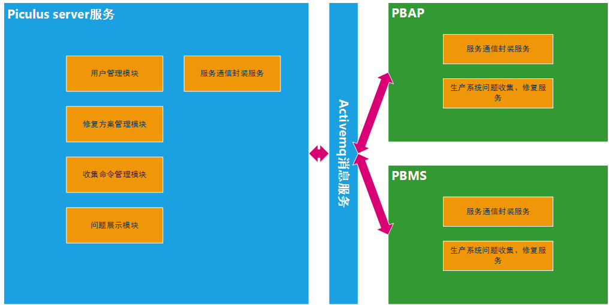

[TOC]

### 产品概述
在公司生产系统运行过程中，系统中产生的数据不在给定的范围内或对于实际业务毫无意义的数据，或是数据格式非法，以及在源系统中存在中断的业务逻辑。这些脏数据就是本次需要解决的问题。

#### 目标
公司传统通过人为修复数据这影响到系统稳定性，增加人工成本，增加人为出错几率。现在就是通过该产品解决人为操作改为系统操作。提供生产系统中用户更安心、放心的用户体验

#### 总体流程

#### 产品结构

#### 信息结构

#### 功能摘要

##### server端
1. server端与client端消息通信
2. 消息通信监控列表
3. 控制发送收集命令
3. 收集命令列表展示
4. 上报问题列表展示
5. 修复方案配置管理
6. 修复方案配置展示
7. 修复方案下发执行展示
7. 用户管理

##### client端
1. 接收server端发送的收集命令，返回收集的问题数据
2. 接收server端发送的修复命令，返回问题的处理结果
1. 修复在充值过程中，数据状态显示充值**成功**，但是生产系统账户**金额并没有增加**
2. 修复在提现过程中，数据状态显示提现**成功**，但是生产系统账户**未扣除提现金额**，银行账户并**没有收到到帐通知**
3. 修复在提现过程中，数据状态显示提现**成功**，但是生产系统账户**已扣除提现金额**，银行账户并**没有收到到帐通知**
4. 修复在充值过程中，数据状态显示充值**失败**，但是银行账户**已扣除充值金额**，生产系统账户**金额并没有增加**
5. 修复在充值过程中，数据状态长时间显示充值**处理中**，但是银行账户**已扣除充值金额**，生产系统数据状态**没有显示成功**，生产系统账户**金额并没有增加**
6. 修复在充值过程中，数据状态长时间显示充值**处理中**，但是银行账户**未扣除充值金额**，生产系统数据状态**没有显示失败**
7. 修复在提现过程中，数据状态显示提现**失败**，但是生产系统账户**已扣除提现金额**，但是银行账户并**没有收到到帐通知**
8. 修复在提现过程中，数据状态长时间显示提现**处理中**，但是银行账户**已经收到到帐通知**，生产系统账户金额并没有增加
9. 修复在提现过程中，数据状态长时间显示提现**处理中**，但是银行账户**没有收到到帐通知**，生产系统数据状态没有显示失败

### 产品特性
。。。。

### 用例流程

### server端与client端消息通信

### 消息通信监控列表

### 控制发送收集命令

### 收集命令列表展示

### 修复方案配置管理
| 参数名称 | 默认值 | 值列表 | 解释 |
|--------|--------|--------|--------|
|系统组别|  |PBAP、PBMS... | 生产系统sysCode |
|修复代号|  | interRechargeFixServiceImpl.. | 修复服务实例名，首字符小写 |
|最大重试次数| 0 | 0～99 |        |
|重试间隔| 0 0/2 * * * ? | `* * * * * *` | cron表达式 |
|执行方式| 自动 | 自动/手动 | 选择手动需要在piculus中点击执行，自动使用cron表达式执行 |
|方案状态| 正常 | 正常/失效 | 正常代表该修复代号可以使用，失效就不能使用 |
|方案等级| 非常重要  | 不重要/一般/重要/非常重要 | 标记数据重要程度 |
|描述|  |        | 描述修复代号作用方便查看 |

#### 根据以上参数配置修复执行方案

查询SQL：
SELECT TRD_ID,TRD_NUM,TRD_STATUS,ACC_TRD_NUM,ACC_TRD_STATUS,E_ACC_TRD_NUM,E_ACC_TRD_STATUS,FAILED_MSG FROM TPBAP_TRD_ACC_TRADE WHERE TRD_NUM=‘?’;

##### 修复在充值过程中，数据状态显示充值**成功**，但是生产系统账户**金额并没有增加**

配置方案

|系统组别 |修复代号                        |最大重试次数 |重试间隔       |方案状态 |方案等级 |描述                         |执行方式|
|----------|--------------------------------|-------------|---------------|-----------|----------|--------------------------------|---------|
|PBAP      |interRechargeFixServiceImpl     |5            |`0 0/10 * * * ?`  |正常     |非常重要     | TEST                            |自动|

配置方案解释
> 服务端发送收集命令后`系统组别`的生产系统，首页》流程控制》发起收集广播
> 生产系统上报问题数据到服务端，可以在 首页》修复查询》检查异常查询
> 服务端根据配置方案确定方案状态，如果失效则不执行修复方案
> 服务端根据配置方案确定执行方式，如果手动则不执行修复方案，首页》流程控制》异常处理 中查询手动点击执行
> 服务端根据配置方案确定执行方式，如果自动则会根据重试间隔没10分钟（0 0/10 * * * ?）执行修复方案
> 服务端根据配置方案如果执行成功则不再重试，执行失败则根据重试间隔再次执行

查询SQL：
SELECT TRD_ID,TRD_NUM,TRD_STATUS,ACC_TRD_NUM,ACC_TRD_STATUS,E_ACC_TRD_NUM,E_ACC_TRD_STATUS,FAILED_MSG FROM TPBAP_TRD_ACC_TRADE WHERE TRD_NUM=‘CO160724154936100036’;

修复前：

|TRD_ID |TRD_NUM              |TRD_STATUS |ACC_TRD_NUM          |ACC_TRD_STATUS |E_ACC_TRD_NUM |E_ACC_TRD_STATUS |FAILED_MSG |
|-------|---------------------|-----------|---------------------|---------------|--------------|-----------------|-----------|
|75     |CO160724154936100036 |8          |                     |0              |              |                 |           |

修复成功后：

|TRD_ID |TRD_NUM              |TRD_STATUS |ACC_TRD_NUM          |ACC_TRD_STATUS |E_ACC_TRD_NUM |E_ACC_TRD_STATUS |FAILED_MSG |
|-------|---------------------|-----------|---------------------|---------------|--------------|-----------------|-----------|
|75     |CO160724154936100036 |8          |GA160724154946100112 |1              |              |                 |充值成功修复 |

#####  修复在提现过程中，数据状态显示提现**成功**，但是生产系统账户**未扣除提现金额**，银行账户并**没有收到到帐通知**

配置方案

|系统组别   |修复代号                          |最大重试次数   |重试间隔        |方案状态     |方案等级   |描述                         |执行方式|
|----------|--------------------------------|-------------|---------------|-----------|----------|--------------------------------|---------|
|PBAP      |interWithdrawFixServiceImpl     |5            |`0 0/10 * * * ?`  |正常     |非常重要     | TEST                            |自动|

配置方案解释
> 服务端发送收集命令后`系统组别`的生产系统，首页》流程控制》发起收集广播
> 生产系统上报问题数据到服务端，可以在 首页》修复查询》检查异常查询
> 服务端根据配置方案确定方案状态，如果失效则不执行修复方案
> 服务端根据配置方案确定执行方式，如果手动则不执行修复方案，首页》流程控制》异常处理 中查询手动点击执行
> 服务端根据配置方案确定执行方式，如果自动则会根据重试间隔没10分钟（0 0/10 * * * ?）执行修复方案
> 服务端根据配置方案如果执行成功则不再重试，执行失败则根据重试间隔再次执行

修复前：

|TRD_ID |TRD_NUM              |TRD_STATUS |ACC_TRD_NUM |ACC_TRD_STATUS |E_ACC_TRD_NUM |E_ACC_TRD_STATUS |FAILED_MSG |
|-------|---------------------|-----------|------------|---------------|--------------|-----------------|-----------|
|679    |WD160731140732100269 |8          |            |0              |              |0                |

修复成功后：

|TRD_ID |TRD_NUM              |TRD_STATUS |ACC_TRD_NUM |ACC_TRD_STATUS |E_ACC_TRD_NUM |E_ACC_TRD_STATUS |FAILED_MSG |
|-------|---------------------|-----------|------------|---------------|--------------|-----------------|-----------|
|679    |WD160731140732100269 |8          |GA160724154946100113 |1              |GA160724154946100113 |1                | 提现成功修复|

#####  修复在提现过程中，数据状态显示提现**成功**，但是生产系统账户**已扣除提现金额**，银行账户并**没有收到到帐通知**

配置方案

|系统组别 |修复代号                        |最大重试次数 |重试间隔       |方案状态 |方案等级 |描述                         |执行方式|
|----------|--------------------------------|-------------|---------------|-----------|----------|--------------------------------|---------|
|PBAP      |interWithdrawAccFixServiceImpl     |5            |`0 0/10 * * * ?`  |正常     |非常重要     | TEST                            |自动|

配置方案解释
> 服务端发送收集命令后`系统组别`的生产系统，首页》流程控制》发起收集广播
> 生产系统上报问题数据到服务端，可以在 首页》修复查询》检查异常查询
> 服务端根据配置方案确定方案状态，如果失效则不执行修复方案
> 服务端根据配置方案确定执行方式，如果手动则不执行修复方案，首页》流程控制》异常处理 中查询手动点击执行
> 服务端根据配置方案确定执行方式，如果自动则会根据重试间隔没10分钟（0 0/10 * * * ?）执行修复方案
> 服务端根据配置方案如果执行成功则不再重试，执行失败则根据重试间隔再次执行

修复前：

|TRD_ID |TRD_NUM              |TRD_STATUS |ACC_TRD_NUM |ACC_TRD_STATUS |E_ACC_TRD_NUM |E_ACC_TRD_STATUS |FAILED_MSG |
|-------|---------------------|-----------|------------|---------------|--------------|-----------------|-----------|
|679    |WD160731140732100269 |8          | GA160724154946100113|1              |              |0                |

修复成功后：

|TRD_ID |TRD_NUM              |TRD_STATUS |ACC_TRD_NUM |ACC_TRD_STATUS |E_ACC_TRD_NUM |E_ACC_TRD_STATUS |FAILED_MSG |
|-------|---------------------|-----------|------------|---------------|--------------|-----------------|-----------|
|679    |WD160731140732100269 |8          |GA160724154946100113 |1              |GA160724154946100114 |1                | 提现成功修复|

#####  修复在充值过程中，数据状态显示充值**失败**，但是银行账户**已扣除充值金额**，生产系统账户**金额并没有增加**

配置方案

|系统组别 |修复代号                        |最大重试次数 |重试间隔       |方案状态 |方案等级 |描述                         |执行方式|
|----------|--------------------------------|-------------|---------------|-----------|----------|--------------------------------|---------|
|PBAP      |rechargeFailedFixServiceImpl     |5            |`0 0/10 * * * ?`  |正常     |非常重要     | TEST                            |自动|

配置方案解释
> 服务端发送收集命令后`系统组别`的生产系统，首页》流程控制》发起收集广播
> 生产系统上报问题数据到服务端，可以在 首页》修复查询》检查异常查询
> 服务端根据配置方案确定方案状态，如果失效则不执行修复方案
> 服务端根据配置方案确定执行方式，如果手动则不执行修复方案，首页》流程控制》异常处理 中查询手动点击执行
> 服务端根据配置方案确定执行方式，如果自动则会根据重试间隔没10分钟（0 0/10 * * * ?）执行修复方案
> 服务端根据配置方案如果执行成功则不再重试，执行失败则根据重试间隔再次执行
> 服务端根据配置方案最大重试次数，当重试5次还是失败则不再重试

修复前：

|TRD_ID |TRD_NUM              |TRD_STATUS |ACC_TRD_NUM          |ACC_TRD_STATUS |E_ACC_TRD_NUM |E_ACC_TRD_STATUS |FAILED_MSG |
|-------|---------------------|-----------|---------------------|---------------|--------------|-----------------|-----------|
|75     |CO160724154936100036 |9          | |0| | | |

修复成功后：

TRD_ID |TRD_NUM              |TRD_STATUS |ACC_TRD_NUM          |ACC_TRD_STATUS |E_ACC_TRD_NUM |E_ACC_TRD_STATUS |FAILED_MSG |
-------|---------------------|-----------|---------------------|---------------|--------------|-----------------|-----------|
75     |CO160724154936100036 |8          |GA160724154946100112 |1              |              |                 |充值成功修复|

#####  修复在充值过程中，数据状态长时间显示充值**处理中**，但是银行账户**已扣除充值金额**，生产系统数据状态**没有显示成功**，生产系统账户**金额并没有增加** & 修复在充值过程中，数据状态长时间显示充值**处理中**，但是银行账户**未扣除充值金额**，生产系统数据状态**没有显示失败**

配置方案

|系统组别 |修复代号                        |最大重试次数 |重试间隔       |方案状态 |方案等级 |描述                         |执行方式|
|----------|--------------------------------|-------------|---------------|-----------|----------|--------------------------------|---------|
|PBAP      |rechargeTimeoutFixServiceImpl     |5            |`0 0/10 * * * ?`  |正常     |非常重要     | TEST                            |自动|

配置方案解释
> 服务端发送收集命令后`系统组别`的生产系统，首页》流程控制》发起收集广播
> 生产系统上报问题数据到服务端，可以在 首页》修复查询》检查异常查询
> 服务端根据配置方案确定方案状态，如果失效则不执行修复方案
> 服务端根据配置方案确定执行方式，如果手动则不执行修复方案，首页》流程控制》异常处理 中查询手动点击执行
> 服务端根据配置方案确定执行方式，如果自动则会根据重试间隔没10分钟（0 0/10 * * * ?）执行修复方案
> 服务端根据配置方案如果执行成功则不再重试，执行失败则根据重试间隔再次执行
> 服务端根据配置方案最大重试次数，当重试5次还是失败则不再重试

修复前：

|TRD_ID |TRD_NUM              |TRD_STATUS |ACC_TRD_NUM          |ACC_TRD_STATUS |E_ACC_TRD_NUM |E_ACC_TRD_STATUS |FAILED_MSG |
|-------|---------------------|-----------|---------------------|---------------|--------------|-----------------|-----------|
|75     |CO160724154936100036 |0          | |0| | |

修复成功后：

|TRD_ID |TRD_NUM              |TRD_STATUS |ACC_TRD_NUM          |ACC_TRD_STATUS |E_ACC_TRD_NUM |E_ACC_TRD_STATUS |FAILED_MSG |
|-------|---------------------|-----------|---------------------|---------------|--------------|-----------------|-----------|
|75     |CO160724154936100036 |8          |GA160724154946100112 |1              |              |                 |充值成功修复
或

|TRD_ID |TRD_NUM              |TRD_STATUS |ACC_TRD_NUM          |ACC_TRD_STATUS |E_ACC_TRD_NUM |E_ACC_TRD_STATUS |FAILED_MSG |
|-------|---------------------|-----------|---------------------|---------------|--------------|-----------------|-----------|
|75     |CO160724154936100036 |9          | |0              |              |                 |充值成功修复

#####  修复在提现过程中，数据状态显示提现**失败**，但是生产系统账户**已扣除提现金额**，但是银行账户并**没有收到到帐通知**,一次性记账

配置方案

|系统组别 |修复代号                        |最大重试次数 |重试间隔       |方案状态 |方案等级 |描述                         |执行方式|
|----------|--------------------------------|-------------|---------------|-----------|----------|--------------------------------|---------|
|PBAP      |withdrawFailedFixServiceImpl     |5            |`0 0/10 * * * ?`  |正常     |非常重要     | TEST                            |自动|

配置方案解释
> 服务端发送收集命令后`系统组别`的生产系统，首页》流程控制》发起收集广播
> 生产系统上报问题数据到服务端，可以在 首页》修复查询》检查异常查询
> 服务端根据配置方案确定方案状态，如果失效则不执行修复方案
> 服务端根据配置方案确定执行方式，如果手动则不执行修复方案，首页》流程控制》异常处理 中查询手动点击执行
> 服务端根据配置方案确定执行方式，如果自动则会根据重试间隔没10分钟（0 0/10 * * * ?）执行修复方案
> 服务端根据配置方案如果执行成功则不再重试，执行失败则根据重试间隔再次执行
> 服务端根据配置方案最大重试次数，当重试5次还是失败则不再重试

修复前：

|TRD_ID |TRD_NUM              |TRD_STATUS |ACC_TRD_NUM          |ACC_TRD_STATUS |E_ACC_TRD_NUM        |E_ACC_TRD_STATUS |FAILED_MSG |
|-------|---------------------|-----------|---------------------|---------------|---------------------|-----------------|-----------|
|719    |WD160731221523100283 |9          | |0              |                     |0                |...

修复成功后：

|TRD_ID |TRD_NUM              |TRD_STATUS |ACC_TRD_NUM          |ACC_TRD_STATUS |E_ACC_TRD_NUM        |E_ACC_TRD_STATUS |FAILED_MSG |
|-------|---------------------|-----------|---------------------|---------------|---------------------|-----------------|-----------|
|719    |WD160731221523100281 |8          |GA160731221523100867 |1              |GA160731221523100867 |1                |提现成功修复

#####  修复在提现过程中，数据状态显示提现**失败**，但是生产系统账户**已扣除提现金额**，但是银行账户并**没有收到到帐通知**，分段式记账

配置方案

|系统组别 |修复代号                        |最大重试次数 |重试间隔       |方案状态 |方案等级 |描述                         |执行方式|
|----------|--------------------------------|-------------|---------------|-----------|----------|--------------------------------|---------|
|PBAP      |withdrawFailedAccFixServiceImpl     |5            |`0 0/10 * * * ?`  |正常     |非常重要     | TEST                            |自动|

配置方案解释
> 服务端发送收集命令后`系统组别`的生产系统，首页》流程控制》发起收集广播
> 生产系统上报问题数据到服务端，可以在 首页》修复查询》检查异常查询
> 服务端根据配置方案确定方案状态，如果失效则不执行修复方案
> 服务端根据配置方案确定执行方式，如果手动则不执行修复方案，首页》流程控制》异常处理 中查询手动点击执行
> 服务端根据配置方案确定执行方式，如果自动则会根据重试间隔没10分钟（0 0/10 * * * ?）执行修复方案
> 服务端根据配置方案如果执行成功则不再重试，执行失败则根据重试间隔再次执行
> 服务端根据配置方案最大重试次数，当重试5次还是失败则不再重试

修复前：

|TRD_ID |TRD_NUM              |TRD_STATUS |ACC_TRD_NUM          |ACC_TRD_STATUS |E_ACC_TRD_NUM        |E_ACC_TRD_STATUS |FAILED_MSG |
|-------|---------------------|-----------|---------------------|---------------|---------------------|-----------------|-----------|
|719    |WD160731221523100281 |9          |GA160731221523100867 |1              |                     |0                |...

修复成功后：

|TRD_ID |TRD_NUM              |TRD_STATUS |ACC_TRD_NUM          |ACC_TRD_STATUS |E_ACC_TRD_NUM        |E_ACC_TRD_STATUS |FAILED_MSG |
|-------|---------------------|-----------|---------------------|---------------|---------------------|-----------------|-----------|
|719    |WD160731221523100281 |8          |GA160731221523100867 |1              |GA160731221523100868 |1                |提现成功修复

#####  修复在提现过程中，数据状态长时间显示提现**处理中**，但是银行账户**已经收到到帐通知**，生产系统账户金额并没有增加 & 修复在提现过程中，数据状态长时间显示提现**处理中**，但是银行账户**没有收到到帐通知**，生产系统数据状态没有显示失败

配置方案

|系统组别 |修复代号                        |最大重试次数 |重试间隔       |方案状态 |方案等级 |描述                         |执行方式|
|----------|--------------------------------|-------------|---------------|-----------|----------|--------------------------------|---------|
|PBAP      |withdrawTimeoutFixServiceImpl     |5            |`0 0/10 * * * ?`  |正常     |非常重要     | TEST                            |自动|

配置方案解释
> 服务端发送收集命令后`系统组别`的生产系统，首页》流程控制》发起收集广播
> 生产系统上报问题数据到服务端，可以在 首页》修复查询》检查异常查询
> 服务端根据配置方案确定方案状态，如果失效则不执行修复方案
> 服务端根据配置方案确定执行方式，如果手动则不执行修复方案，首页》流程控制》异常处理 中查询手动点击执行
> 服务端根据配置方案确定执行方式，如果自动则会根据重试间隔没10分钟（0 0/10 * * * ?）执行修复方案
> 服务端根据配置方案如果执行成功则不再重试，执行失败则根据重试间隔再次执行
> 服务端根据配置方案最大重试次数，当重试5次还是失败则不再重试

修复前：

|TRD_ID |TRD_NUM              |TRD_STATUS |ACC_TRD_NUM          |ACC_TRD_STATUS |E_ACC_TRD_NUM        |E_ACC_TRD_STATUS |FAILED_MSG                                                                        |
|-------|---------------------|-----------|---------------------|---------------|---------------------|-----------------|----------------------------------------------------------------------------------|
|94     |WD160725131938100013 |0          |                     |0              |                     | 0 |...

修复成功后：

|TRD_ID |TRD_NUM              |TRD_STATUS |ACC_TRD_NUM          |ACC_TRD_STATUS |E_ACC_TRD_NUM        |E_ACC_TRD_STATUS |FAILED_MSG                                                                        |
|-------|---------------------|-----------|---------------------|---------------|---------------------|-----------------|----------------------------------------------------------------------------------|
|94     |WD160725131938100013 |8          | GA160725222426100380 |1              | GA160725222426100380   |1                | 提现成功修复
或

|TRD_ID |TRD_NUM              |TRD_STATUS |ACC_TRD_NUM          |ACC_TRD_STATUS |E_ACC_TRD_NUM        |E_ACC_TRD_STATUS |FAILED_MSG                                                                        |
|-------|---------------------|-----------|---------------------|---------------|---------------------|-----------------|----------------------------------------------------------------------------------|
|94     |WD160725131938100013 |9          |  |0              |    |0                | 提现成功修复

### 修复方案配置展示

### 修复方案下发执行展示

### 用户管理
