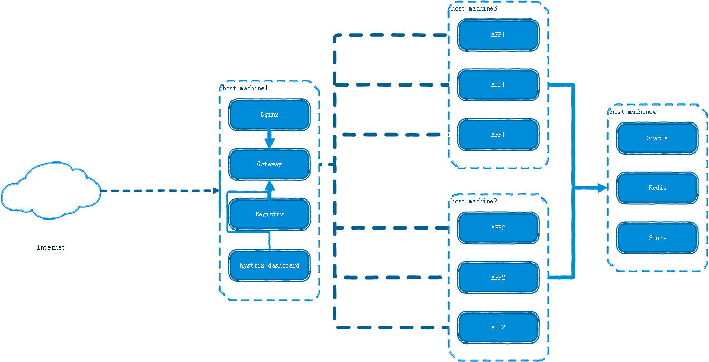
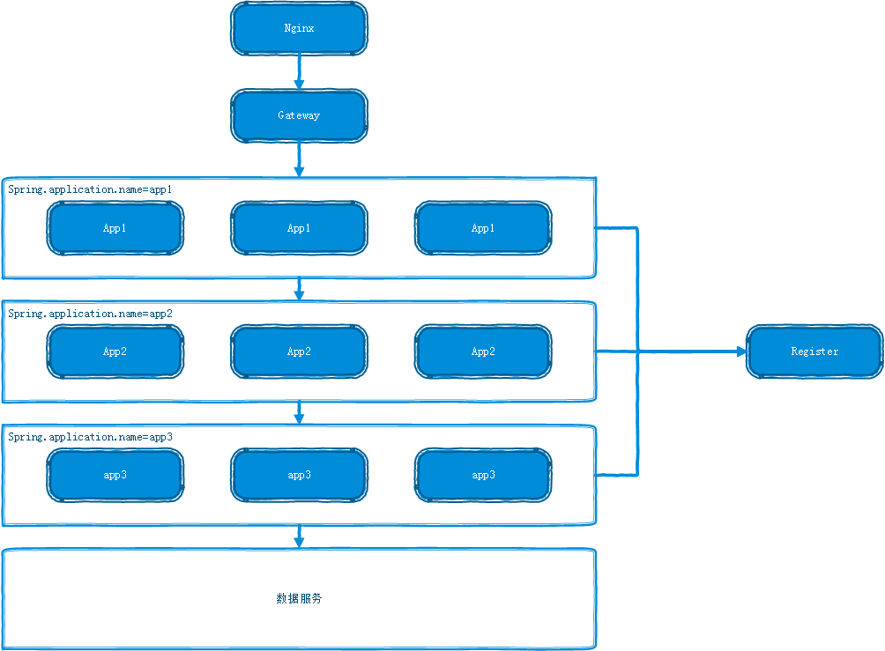
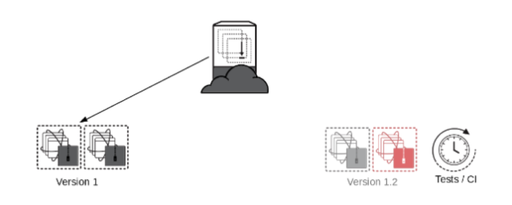
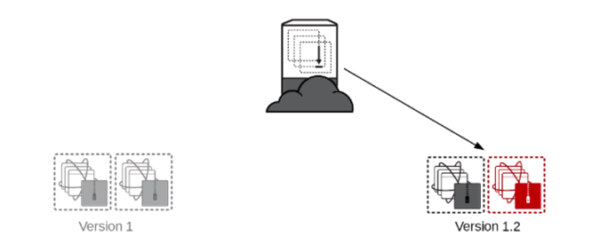
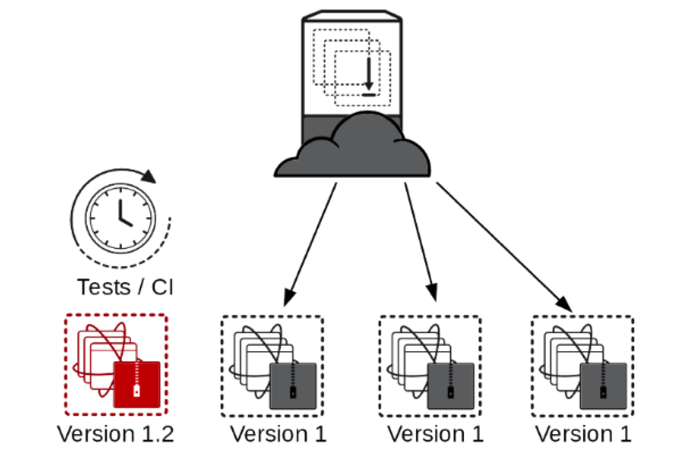

#服务器部署模式

<!-- TOC depthFrom:1 depthTo:6 withLinks:1 updateOnSave:1 orderedList:0 -->

- [服务器部署模式](#服务器部署模式)
	- [背景](#背景)
	- [部署模型](#部署模型)
	- [Red-Black Deployment(红黑部署)](#red-black-deployment红黑部署)
	- [New Deployment(新部署)](#new-deployment新部署)
	- [Rolling Update Deployment(滚动更新部署)](#rolling-update-deployment滚动更新部署)

<!-- /TOC -->
##背景
业务的快速发展要求基础设施的灵活性，更快的部署速度，更快的上线时间，自恢复的系统，但是传统的IT运维的方式在基础设施管理面前给我们带来的很多的挑战:
1. `服务器蔓延(Server Sprawl)`在单块架构下，服务器的数量和需要配置的种类都比较少，然而随着业务发展，或者微服务拆分等，服务器数量，所需配置的种类可能会爆炸式增长，沿用传统的管理方式挑战很大，而且对于相同的服务器可能会导致配置的差异。
2. `配置漂移(Configuration Drift)`服务器的配置可能会随着时间增加。比如有人为了解决一个特定用户的问题，修改了其中一台服务器的配置，这样他们之间就存在了差异。 很有可能会发生，只有在某个环境里面的台服务器上，应用才能正常运行的情况。
3. `雪花服务器(Snowflake Servers)`雪花服务器的意思是该服务器和你的网络中任意其它的服务器都不同，特殊到无法复制。比如，在别的服务器上升级ruby语言后，应用可以运行，但是在某台机器上就是不可以。
4. `脆弱的基础设施(Fragile Infrastructure)`总有一些服务器，在你on-call的时候，祈祷它们不要出问题。
5. `自动化的恐惧(Automation Fear)`缺乏对自动化的信心因为服务器配置不是一致的。服务器不一致是因为没有频繁和一致的运行自动化。
6. `侵蚀(Erosion)`侵蚀就是问题随着时间的推移蔓延到正在运行的系统的意思。比如，服务器磁盘被日志文件塞满，操作系统升级，内核补丁，以及基础设施软件（如Apache，MySQL，SSH，OpenSSL）升级去修复安全漏洞等。

针对以上的问题，解决的办法是将基础设施作为代码，版本管理起来。基础设施即代码是基于从软件开发实践的基础设施自动化的方法。它强调配置和改变系统及其配置的一致性，可重复的程序。变更转化为定义，然后通过包括彻底的验证的无人值守过程应用到系统中。其原则如下:
1. `容易重现的系统`能够毫不费力且可靠地重建基础设施中的任何元素。
2. `可任意处理系统`可以轻松创建、销毁、替换、更改以及移动资源。
3. `一致的系统`假设两个基础设施元素提供相似的服务，比如同一个集群中有两个应用程序服务器。这些服务器应该几乎完全相同。它们的系统软件和配置应该是一样的，除了一丁点配置（比如IP地址）用于区分彼此。
4. `可重复的过程`基于可再生原则，对基础设施执行的任何行为都是可以重复的。也就是说Duang了之后，对于所有人的效果应该是一样的。
5. `变化的设计`确保系统能够安全地改变，迅速的频繁做出变化。

##部署模型
现在服务部署示意图：

##Red-Black Deployment(红黑部署)
> 涉及到接口变更，多层服务修改

红黑部署的好处是服务始终在线，同时采用不可变部署的方式。我们现在采用的部署手段：
* 启动一套新的服务器集群，并通过测试

* 测试通过，将ELB(nginx)指向新的服务器集群

然后销毁掉旧的服务器集群，如此则完成了一次0 downtime的不可变部署。

具体实施过程：
1. 启动registry-server2,gateway-server2,hystrix-dashboard-server2。
2. 按照服务架构启动无需升级的服务并注册到register-server2。
3. 启动升级服务并注册到register-server2。
4. 测试通过gateway-server2访问升级服务是否启动完成,有无BUG。
5. 切换nginx指向gateway-server2。
6. 查看hystrix-dashboard-server1接口访问以全部消失。
7. 查看hystrix-dashboard-server2接口访问以全部正常。
8. 关闭注册到registry-server1的服务。
9. 升级结束。

##New Deployment(新部署)
> 比如活动系统，与其他服务无耦合

在现有restful API接口没有做修改的情况我们可以采用直接启动Docker container接入现有eureka集群中。

##Rolling Update Deployment(滚动更新部署)
> API接口没有做修改的情况

在现有API接口没有做修改的情况我们可以采用：
1. 启动更新的服务。
2. 关闭以前的服务。

