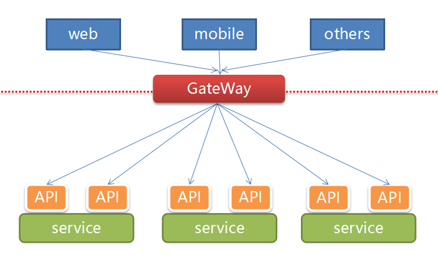

#spring-boot项目改造（spring boot transform）
把普通的java-web-project转换为spring-boot-project

##背景
我们在服务部署与服务治理上每次都会花费大量时间来停止服务运行与重启，服务化面临的挑战提到要实现服务化首先需要解决远程服务调用问题，除此之外，还有很多其他问题需要解决。
* 服务越来越多，配置管理复杂
* 服务间依赖关系复杂
* 服务之间的负载均衡
* 服务的拓展
* 服务监控
* 服务降级
* 服务鉴权
* 服务上线与下线

有没有好的服务治理方案呢？
1. 配置管理-->`spring-cloud`的config服务
1. 服务注册与发现-->`netflix`的`eureka`
1. 服务监控-->`netflix`的`hystrix-dashboard`
1. 服务网关与负载均衡-->`netflix`的`zuul`+`ribbon`
1. 服务鉴权-->`redis`+`spring-session`
1. 服务上线与下线-->`docker`


##为什么要把java-web-project转换为spring-boot-project？
在实现7×24小时服务不宕机架构的时候我们采用了`netflix`公司的开源架构，在使用该架构的时候我们选用`spring-cloud`这个架构平台来更好的使用该技术。`spring-cloud`也是基于`spring-boot`架构设计的，最终在项目代码体现也是采用`spring-boot`项目来实现代码。

###如何修改原有项目变成spring-boot项目？

* jdk:1.8.0_112
* maven:3.3.9
* java servlet:3.0
* spring-boot:1.5.3.RELEASE
* spring-cloud:Dalston.RELEASE

####项目目录结构
```
project/
  |--build.json
  |--pom.xml(parent)(修改)
  |--app/(war项目)
    |--pom.xml(child1)(修改)
    |--src/
      |--main/
        |--docker/
          |--Dockerfile(修改)
        |--java/
        |--resources/
          |--static/
            |--index.html(新增)
          |--bootstrap.yml(新增)
          |--application.yml(新增)
          |--spring-basic.xml(修改)
          |--spring-\*.xml(修改)
        |--webapp/
          |--static-file or static-directory (移动到) src/main/resources/static/
          |--META-INF/
            |--context.xml
          |--META-INF/
            |--web.xml(废弃)
  |--custom/（jar项目）
    |--pom.xml(child2)(修改)
    |--src/
      |--main/
        |--java/
        |--resources/
```

####parent pom.xml文件变化
```xml
<?xml version="1.0" encoding="UTF-8"?>
<project xmlns="http://maven.apache.org/POM/4.0.0" xmlns:xsi="http://www.w3.org/2001/XMLSchema-instance"
	xsi:schemaLocation="http://maven.apache.org/POM/4.0.0 http://maven.apache.org/xsd/maven-4.0.0.xsd">
	<modelVersion>4.0.0</modelVersion>
  ---新增
	<parent>
		<groupId>org.springframework.boot</groupId>
		<artifactId>spring-boot-starter-parent</artifactId>
		<version>1.5.2.RELEASE</version>
	</parent>
  ---end

	<groupId>com.joinwe</groupId>
	<artifactId>zkp-xxx</artifactId>
	<version>1.x.x-SNAPSHOT</version>
	<packaging>pom</packaging>

	<properties>
		<project.build.sourceEncoding>UTF-8</project.build.sourceEncoding>
    ---新增以及修改
		<java.version>1.8</java.version><!-- 强制：jdk版本 -->
		<tomcat.version>7.0.77</tomcat.version><!-- 强制：tomcat版本 -->
    ---自定义jar
		<!-- joinwe jar -->
		<custom.version>2.0.4-RELEASE</custom.version>
    <!-- spring dependency jar -->
    <!-- <activemq.version>5.14.3</activemq.version> -->
    <!-- <antlr2.version>2.7.7</antlr2.version> -->
    <!-- <appengine-sdk.version>1.9.49</appengine-sdk.version> -->
    <!-- <artemis.version>1.5.3</artemis.version> -->
    <!-- <aspectj.version>1.8.9</aspectj.version> -->
    <!-- <assertj.version>2.6.0</assertj.version> -->
    <!-- <atomikos.version>3.9.3</atomikos.version> -->
    <!-- <bitronix.version>2.1.4</bitronix.version> -->
    <!-- <caffeine.version>2.3.5</caffeine.version> -->
    <!-- <cassandra-driver.version>3.1.4</cassandra-driver.version> -->
    <!-- <classmate.version>1.3.3</classmate.version> -->
    <!-- <commons-beanutils.version>1.9.3</commons-beanutils.version> -->
    <!-- <commons-collections.version>3.2.2</commons-collections.version> -->
    <!-- <commons-codec.version>1.10</commons-codec.version> -->
    <!-- <commons-dbcp.version>1.4</commons-dbcp.version> -->
    <!-- <commons-dbcp2.version>2.1.1</commons-dbcp2.version> -->
    <!-- <commons-digester.version>2.1</commons-digester.version> -->
    <!-- <commons-pool.version>1.6</commons-pool.version> -->
    <!-- <commons-pool2.version>2.4.2</commons-pool2.version> -->
    <!-- <couchbase-client.version>2.3.7</couchbase-client.version> -->
    <!-- <couchbase-cache-client.version>2.1.0</couchbase-cache-client.version> -->
    <!-- <crashub.version>1.3.2</crashub.version> -->
    <!-- <derby.version>10.13.1.1</derby.version> -->
    <!-- <dom4j.version>1.6.1</dom4j.version> -->
    <!-- <dropwizard-metrics.version>3.1.3</dropwizard-metrics.version> -->
    <!-- <ehcache.version>2.10.3</ehcache.version> -->
    <!-- <ehcache3.version>3.2.1</ehcache3.version> -->
    <!-- <embedded-mongo.version>1.50.5</embedded-mongo.version> -->
    <!-- <flyway.version>3.2.1</flyway.version> -->
    <!-- <freemarker.version>2.3.25-incubating</freemarker.version> -->
    <!-- <elasticsearch.version>2.4.4</elasticsearch.version> -->
    <!-- <gemfire.version>8.2.2</gemfire.version> -->
    <!-- <glassfish-el.version>3.0.0</glassfish-el.version> -->
    <!-- <gradle.version>2.9</gradle.version> -->
    <!-- <groovy.version>2.4.9</groovy.version> -->
    <!-- <gson.version>2.8.0</gson.version> -->
    <!-- <h2.version>1.4.193</h2.version> -->
    <!-- <hamcrest.version>1.3</hamcrest.version> -->
    <!-- <hazelcast.version>3.7.5</hazelcast.version> -->
    <!-- <hazelcast-hibernate4.version>3.7.1</hazelcast-hibernate4.version> -->
    <!-- <hazelcast-hibernate5.version>1.1.3</hazelcast-hibernate5.version> -->
    <!-- <hibernate.version>5.0.12.Final</hibernate.version> -->
    <!-- <hibernate-validator.version>5.3.4.Final</hibernate-validator.version> -->
    <!-- <hikaricp.version>2.5.1</hikaricp.version> -->
    <!-- <hikaricp-java6.version>2.3.13</hikaricp-java6.version> -->
    <!-- <hikaricp-java7.version>2.4.11</hikaricp-java7.version> -->
    <!-- <hsqldb.version>2.3.3</hsqldb.version> -->
    <!-- <htmlunit.version>2.21</htmlunit.version> -->
    <!-- <httpasyncclient.version>4.1.3</httpasyncclient.version> -->
    <!-- <httpclient.version>4.5.3</httpclient.version> -->
    <!-- <httpcore.version>4.4.6</httpcore.version> -->
    <!-- <infinispan.version>8.2.6.Final</infinispan.version> -->
    <!-- <jackson.version>2.8.7</jackson.version> -->
    <!-- <janino.version>2.7.8</janino.version> -->
    <!-- <javassist.version>3.21.0-GA</javassist.version> Same as Hibernate -->
    <!-- <javax-cache.version>1.0.0</javax-cache.version> -->
    <!-- <javax-mail.version>1.5.6</javax-mail.version> -->
    <!-- <javax-transaction.version>1.2</javax-transaction.version> -->
    <!-- <javax-validation.version>1.1.0.Final</javax-validation.version> -->
    <!-- <jaxen.version>1.1.6</jaxen.version> -->
    <!-- <jaybird.version>2.2.12</jaybird.version> -->
    <!-- <jboss-logging.version>3.3.0.Final</jboss-logging.version> -->
    <!-- <jboss-transaction-spi.version>7.5.1.Final</jboss-transaction-spi.version> -->
    <!-- <jdom2.version>2.0.6</jdom2.version> -->
    <!-- <jedis.version>2.9.0</jedis.version> -->
    <!-- <jersey.version>2.25.1</jersey.version> -->
    <!-- <jest.version>2.0.4</jest.version> -->
    <!-- <jetty.version>9.4.2.v20170220</jetty.version> -->
    <!-- <jetty-jsp.version>2.2.0.v201112011158</jetty-jsp.version> -->
    <!-- <jetty-el.version>8.0.33</jetty-el.version> -->
    <!-- <jms-api.version>1.1-rev-1</jms-api.version> -->
    <!-- <jmustache.version>1.13</jmustache.version> -->
    <!-- <jna.version>4.2.2</jna.version> -->
    <!-- <joda-time.version>2.9.7</joda-time.version> -->
    <!-- <jolokia.version>1.3.5</jolokia.version> -->
    <!-- <jooq.version>3.9.1</jooq.version> -->
    <!-- <json.version>20140107</json.version> -->
    <!-- <jsonassert.version>1.4.0</jsonassert.version> -->
    <!-- <json-path.version>2.2.0</json-path.version> -->
    <!-- <jstl.version>1.2</jstl.version> -->
    <!-- <jtds.version>1.3.1</jtds.version> -->
    <!-- <junit.version>4.12</junit.version> -->
    <!-- <liquibase.version>3.5.3</liquibase.version> -->
    <!-- <log4j2.version>2.7</log4j2.version> -->
    <!-- <logback.version>1.1.11</logback.version> -->
    <!-- <lombok.version>1.16.14</lombok.version> -->
    <!-- <mariadb.version>1.5.8</mariadb.version> -->
    <!-- <mssql-jdbc.version>6.1.0.jre7</mssql-jdbc.version> -->
    <!-- <mockito.version>1.10.19</mockito.version> -->
    <!-- <mongodb.version>3.4.2</mongodb.version> -->
    <!-- <mysql.version>5.1.41</mysql.version> -->
    <!-- <narayana.version>5.5.3.Final</narayana.version> -->
    <!-- <nekohtml.version>1.9.22</nekohtml.version> -->
    <!-- <neo4j-ogm.version>2.1.1</neo4j-ogm.version> -->
    <!-- <postgresql.version>9.4.1212.jre7</postgresql.version> -->
    <!-- <querydsl.version>4.1.4</querydsl.version> -->
    <!-- <reactor.version>2.0.8.RELEASE</reactor.version> -->
    <!-- <reactor-spring.version>2.0.7.RELEASE</reactor-spring.version> -->
    <!-- <selenium.version>2.53.1</selenium.version> -->
    <!-- <selenium-htmlunit.version>2.21</selenium-htmlunit.version> -->
    <!-- <sendgrid.version>2.2.2</sendgrid.version> -->
    <!-- <servlet-api.version>3.1.0</servlet-api.version> -->
    <!-- <simple-json.version>1.1.1</simple-json.version> -->
    <!-- <slf4j.version>1.7.24</slf4j.version> -->
    <!-- <snakeyaml.version>1.17</snakeyaml.version> -->
    <!-- <solr.version>5.5.4</solr.version> -->
    <!-- <spock.version>1.0-groovy-2.4</spock.version> -->
    <!-- <spring.version>4.3.7.RELEASE</spring.version> -->
    <!-- <spring-amqp.version>1.7.1.RELEASE</spring-amqp.version> -->
    <!-- <spring-cloud-connectors.version>1.2.3.RELEASE</spring-cloud-connectors.version> -->
    <!-- <spring-batch.version>3.0.7.RELEASE</spring-batch.version> -->
    <!-- <spring-data-releasetrain.version>Ingalls-SR1</spring-data-releasetrain.version> -->
    <!-- <spring-hateoas.version>0.23.0.RELEASE</spring-hateoas.version> -->
    <!-- <spring-integration.version>4.3.8.RELEASE</spring-integration.version> -->
    <!-- <spring-integration-java-dsl.version>1.2.1.RELEASE</spring-integration-java-dsl.version> -->
    <!-- <spring-kafka.version>1.1.3.RELEASE</spring-kafka.version> -->
    <!-- <spring-ldap.version>2.3.1.RELEASE</spring-ldap.version> -->
    <!-- <spring-loaded.version>1.2.6.RELEASE</spring-loaded.version> -->
    <!-- <spring-mobile.version>1.1.5.RELEASE</spring-mobile.version> -->
    <!-- <spring-plugin.version>1.2.0.RELEASE</spring-plugin.version> -->
    <!-- <spring-restdocs.version>1.1.2.RELEASE</spring-restdocs.version> -->
    <!-- <spring-retry.version>1.2.0.RELEASE</spring-retry.version> -->
    <!-- <spring-security.version>4.2.2.RELEASE</spring-security.version> -->
    <!-- <spring-security-jwt.version>1.0.7.RELEASE</spring-security-jwt.version> -->
    <!-- <spring-security-oauth.version>2.0.13.RELEASE</spring-security-oauth.version> -->
    <!-- <spring-session.version>1.3.0.RELEASE</spring-session.version> -->
    <!-- <spring-social.version>1.1.4.RELEASE</spring-social.version> -->
    <!-- <spring-social-facebook.version>2.0.3.RELEASE</spring-social-facebook.version> -->
    <!-- <spring-social-linkedin.version>1.0.2.RELEASE</spring-social-linkedin.version> -->
    <!-- <spring-social-twitter.version>1.1.2.RELEASE</spring-social-twitter.version> -->
    <!-- <spring-ws.version>2.4.0.RELEASE</spring-ws.version> -->
    <!-- <sqlite-jdbc.version>3.15.1</sqlite-jdbc.version> -->
    <!-- <statsd-client.version>3.1.0</statsd-client.version> -->
    <!-- <sun-mail.version>${javax-mail.version}</sun-mail.version> -->
    <!-- <thymeleaf.version>2.1.5.RELEASE</thymeleaf.version> -->
    <!-- <thymeleaf-extras-springsecurity4.version>2.1.3.RELEASE</thymeleaf-extras-springsecurity4.version> -->
    <!-- <thymeleaf-extras-conditionalcomments.version>2.1.2.RELEASE</thymeleaf-extras-conditionalcomments.version> -->
    <!-- <thymeleaf-layout-dialect.version>1.4.0</thymeleaf-layout-dialect.version> -->
    <!-- <thymeleaf-extras-data-attribute.version>1.3</thymeleaf-extras-data-attribute.version> -->
    <!-- <thymeleaf-extras-java8time.version>2.1.0.RELEASE</thymeleaf-extras-java8time.version> -->
    <!-- <tomcat.version>8.5.11</tomcat.version> -->
    <!-- <undertow.version>1.4.11.Final</undertow.version> -->
    <!-- <unboundid-ldapsdk.version>3.2.1</unboundid-ldapsdk.version> -->
    <!-- <webjars-hal-browser.version>9f96c74</webjars-hal-browser.version> -->
    <!-- <webjars-locator.version>0.32</webjars-locator.version> -->
    <!-- <wsdl4j.version>1.6.3</wsdl4j.version> -->
    <!-- <xml-apis.version>1.4.01</xml-apis.version> -->
    ---第3方jar
    ---end
	</properties>

	<modules>
		<module>app</module>
	</modules>

	<dependencyManagement>
		<dependencies>
			<!-- joinwe jar -->
			<dependency>
				<groupId>com.joinwe</groupId>
				<artifactId>custom</artifactId>
				<version>${custom.version}</version>
			</dependency>
      ---新增以及修改
			<!-- spring cloud all dependency -->
			<dependency>
				<groupId>org.springframework.cloud</groupId>
				<artifactId>spring-cloud-dependencies</artifactId>
				<version>Dalston.RELEASE</version>
				<type>pom</type>
				<scope>import</scope>
			</dependency>
			<!-- mybatis -->
			<dependency>
				<groupId>org.mybatis.spring.boot</groupId>
				<artifactId>mybatis-spring-boot-starter</artifactId>
				<version>1.1.1</version>
			</dependency>
      <!-- 删除spring其他依赖jar -->
      <!-- 第3方依赖jar不变 -->
	</dependencies>

  <build>
		<pluginManagement>
			<plugins>
				<!-- plugin versions:spring提供maven插件及版本 -->
				<!-- <build-helper-maven-plugin.version>1.10</build-helper-maven-plugin.version> -->
				<!-- <exec-maven-plugin.version>1.5.0</exec-maven-plugin.version> -->
				<!-- <git-commit-id-plugin.version>2.2.2</git-commit-id-plugin.version> -->
				<!-- <maven-antrun-plugin.version>1.8</maven-antrun-plugin.version> -->
				<!-- <maven-assembly-plugin.version>2.6</maven-assembly-plugin.version> -->
				<!-- <maven-clean-plugin.version>2.6.1</maven-clean-plugin.version> -->
				<!-- <maven-compiler-plugin.version>3.1</maven-compiler-plugin.version> -->
				<!-- <maven-dependency-plugin.version>2.10</maven-dependency-plugin.version> -->
				<!-- <maven-deploy-plugin.version>2.8.2</maven-deploy-plugin.version> --><!-- 项目部署插件版本>=2.8.2 -->
				<!-- <maven-eclipse-plugin.version>2.10</maven-eclipse-plugin.version> -->
				<!-- <maven-enforcer-plugin.version>1.4</maven-enforcer-plugin.version> -->
				<!-- <maven-failsafe-plugin.version>2.18.1</maven-failsafe-plugin.version> -->
				<!-- <maven-install-plugin.version>2.5.2</maven-install-plugin.version> -->
				<!-- <maven-invoker-plugin.version>1.10</maven-invoker-plugin.version> -->
				<!-- <maven-help-plugin.version>2.2</maven-help-plugin.version> -->
				<!-- <maven-jar-plugin.version>2.6</maven-jar-plugin.version> -->
				<!-- <maven-javadoc-plugin.version>2.10.4</maven-javadoc-plugin.version> -->
				<!-- <maven-resources-plugin.version>2.7</maven-resources-plugin.version> -->
				<!-- <maven-shade-plugin.version>2.4.3</maven-shade-plugin.version> -->
				<!-- <maven-site-plugin.version>3.5.1</maven-site-plugin.version> -->
				<!-- <maven-source-plugin.version>2.4</maven-source-plugin.version> -->
				<!-- <maven-surefire-plugin.version>2.18.1</maven-surefire-plugin.version> -->
				<!-- <maven-war-plugin.version>2.6</maven-war-plugin.version> -->
				<!-- <versions-maven-plugin.version>2.2</versions-maven-plugin.version> --><!-- 版本管理插件版本>=2.2 -->

				<!-- docker插件 -->
				<plugin>
					<groupId>com.spotify</groupId>
					<artifactId>docker-maven-plugin</artifactId>
					<version>0.4.13</version>
				</plugin>
			</plugins>
		</pluginManagement>
	</build>
</project>
```
####child1 pom.xml文件变化

```xml
<?xml version="1.0"?>
<project
	xsi:schemaLocation="http://maven.apache.org/POM/4.0.0 http://maven.apache.org/xsd/maven-4.0.0.xsd"
	xmlns="http://maven.apache.org/POM/4.0.0" xmlns:xsi="http://www.w3.org/2001/XMLSchema-instance">
	<modelVersion>4.0.0</modelVersion>
	<parent>
		<groupId>com.joinwe</groupId>
		<artifactId>zkp-xxx</artifactId>
		<version>1.x.x-SNAPSHOT</version>
	</parent>

	<artifactId>app</artifactId>
	<version>1.x.x-SNAPSHOT</version>
	<name>${project.artifactId}</name>
	<packaging>war</packaging>

	<dependencies>
		<!-- joinwe jar -->
		<!-- junit test -->
		<dependency>
			<groupId>org.springframework.boot</groupId>
			<artifactId>spring-boot-starter-test</artifactId>
			<scope>test</scope>
		</dependency>
		<!-- provided:devtools,tomcat -->
		<dependency>
			<groupId>org.springframework.boot</groupId>
			<artifactId>spring-boot-devtools</artifactId>
			<scope>provided</scope><!-- 编译不打入war -->
		</dependency>
		<dependency>
			<groupId>org.springframework.boot</groupId>
			<artifactId>spring-boot-starter-tomcat</artifactId>
			<scope>provided</scope><!-- 编译不打入war -->
		</dependency>
		<dependency>
			<groupId>org.apache.tomcat</groupId>
			<artifactId>tomcat-jdbc</artifactId>
			<scope>provided</scope>
		</dependency>
		<!-- spring cloud all dependency -->
		<dependency>
			<groupId>org.springframework.cloud</groupId>
			<artifactId>spring-cloud-starter-config</artifactId>
		</dependency>
		<!-- spring cloud eureka -->
		<dependency>
			<groupId>org.springframework.cloud</groupId>
			<artifactId>spring-cloud-starter-eureka</artifactId>
		</dependency>
		<!-- spring boot redis -->
		<dependency>
			<groupId>org.springframework.boot</groupId>
			<artifactId>spring-boot-starter-data-redis</artifactId>
		</dependency>
		<!-- spring boot jersey -->
    <dependency>
			<groupId>org.springframework.boot</groupId>
			<artifactId>spring-boot-starter-jersey</artifactId>
		</dependency>
		<!-- spring boot mybatis -->
		<dependency>
			<groupId>org.mybatis.spring.boot</groupId>
			<artifactId>mybatis-spring-boot-starter</artifactId>
		</dependency>
		<!-- 第3方jar -->
	</dependencies>

	<build>
		<finalName>${project.name}</finalName>
		<plugins>
			<plugin>
				<groupId>org.springframework.boot</groupId>
				<artifactId>spring-boot-maven-plugin</artifactId>
			</plugin>
			<plugin>
				<groupId>com.spotify</groupId>
				<artifactId>docker-maven-plugin</artifactId>
				<configuration>
					<serverId>docker-hub</serverId>
					<registryUrl>https://zkpregistry.com:5043/v2/</registryUrl>
					<imageName>zkpregistry.com:5043/${project.name}</imageName><!-- ${project.name}不能有大写字母 -->
					<dockerDirectory>src/main/docker</dockerDirectory>
					<forceTags>true</forceTags>
					<imageTags>
						<imageTag>${project.version}</imageTag>
					</imageTags>
					<resources>
						<resource>
							<targetPath>/</targetPath>
							<directory>${project.build.directory}</directory>
							<include>${project.name}.war</include>
						</resource>
					</resources>
				</configuration>
			</plugin>
		</plugins>
	</build>
</project>
```

####增加bootstrap.yml文件
```yml
spring:
  application:
    name: ${spring.application.name}
  cloud:                                                  # spring config配置
    config:
      name: ${spring.application.name}
      profile: ${spring.application.profile}
      uri: ${spring.application.config.server}            # spring config地址

endpoints:
  restart:
    enabled: true     #重启应用程序,config服务加载修改后的配置
  refresh:
    enabled: false    #刷新应用程序,config服务git修改是否生效，不建议使用，某些服务不会被刷新

eureka:
  client:                                                 # eureka config配置
    serviceUrl:
      defaultZone: http://192.168.1.232:7241/eureka/      # eureka server地址
  instance:
    hostname: ${server.address}

server:
  port: ${server.post}                                    # eureka 读取端口
```
####增加application.yml文件

```yml
#...
```

####增加static文件夹
classpath:/META-INF/resources/,classpath:/resources/,classpath:/static/,classpath:/public/为spring-boot项目默认的静态资源文件夹，把原webapp/\*静态文件迁移到src/main/resources/static/文件夹下，如没有该文件，请创建

####增加Application.java文件
在com.joinwe.xxx下创建Application.java文件,一下来自pbms项目改造文件：
```java
package com.joinwe.pbms;

import java.util.ArrayList;
import java.util.List;

import javax.servlet.MultipartConfigElement;

import org.mybatis.spring.boot.autoconfigure.MybatisAutoConfiguration;
import org.springframework.boot.SpringApplication;
import org.springframework.boot.autoconfigure.SpringBootApplication;
import org.springframework.boot.autoconfigure.jdbc.DataSourceAutoConfiguration;
import org.springframework.boot.autoconfigure.jdbc.DataSourceTransactionManagerAutoConfiguration;
import org.springframework.boot.builder.SpringApplicationBuilder;
import org.springframework.boot.web.servlet.FilterRegistrationBean;
import org.springframework.boot.web.servlet.ServletRegistrationBean;
import org.springframework.boot.web.support.SpringBootServletInitializer;
import org.springframework.cloud.netflix.eureka.EnableEurekaClient;
import org.springframework.context.annotation.Bean;
import org.springframework.context.annotation.ComponentScan;
import org.springframework.context.annotation.ImportResource;
import org.springframework.http.MediaType;
import org.springframework.http.converter.HttpMessageConverter;
import org.springframework.http.converter.StringHttpMessageConverter;
import org.springframework.http.converter.json.MappingJackson2HttpMessageConverter;
import org.springframework.web.filter.CharacterEncodingFilter;
import org.springframework.web.multipart.commons.CommonsMultipartResolver;
import org.springframework.web.servlet.DispatcherServlet;
import org.springframework.web.servlet.mvc.method.annotation.RequestMappingHandlerAdapter;

import com.joinwe.pbms.filter.NoCacheFilter;
import com.joinwe.pbms.filter.SessionFilter;
import com.joinwe.pbms.servlet.FileUpLoadServlet;
import com.joinwe.pbms.servlet.FinanceApplyServlet;
import com.joinwe.pbms.servlet.RandCodeServlet;

/**
 * 启动器
 * @author delxie
 *
 */
@SpringBootApplication(exclude = { DataSourceAutoConfiguration.class,
		DataSourceTransactionManagerAutoConfiguration.class,
		MybatisAutoConfiguration.class })
@ComponentScan(basePackages = "com.joinwe.pbms.*,com.joinwe.bssp.*,com.joinwe.common.*")
@ImportResource(locations = { "classpath*:spring-basic.xml" })
@EnableEurekaClient
public class Application extends SpringBootServletInitializer {

	/**
	 * web.xml初始化
	 */
	@Override
	protected SpringApplicationBuilder configure(SpringApplicationBuilder application) {
		return application.sources(Application.class);
	}

	public static void main(String[] args) {
		SpringApplication.run(Application.class, args);
	}

	// -----------------------------------------------------------------------
	// listener
	// -----------------------------------------------------------------------

	// -----------------------------------------------------------------------
	// filter
	// -----------------------------------------------------------------------
	/**
	 * 请求编码filter
	 * @return
	 */
	@Bean
	public FilterRegistrationBean characterEncodingFilterRegistration() {
		FilterRegistrationBean registration = new FilterRegistrationBean();
		CharacterEncodingFilter filter = new CharacterEncodingFilter();
		registration.setFilter(filter);
		registration.setName("characterEncodingFilter");
		registration.addInitParameter("encoding", "UTF-8");
		registration.addUrlPatterns("/*");
		registration.setOrder(1);
		return registration;
	}

	/**
	 * 请求缓存filter
	 * @return
	 */
	@Bean
	public FilterRegistrationBean noCacheFilterRegistration() {
		FilterRegistrationBean registration = new FilterRegistrationBean();
		NoCacheFilter filter = new NoCacheFilter();
		registration.setFilter(filter);
		registration.setName("noCacheFilter");
		registration.addUrlPatterns("*.html", "*.js", "*.css");
		registration.setOrder(1);
		return registration;
	}

	/**
	 * 请求session filter
	 * @return
	 */
	@Bean
	public FilterRegistrationBean sessionFilterRegistration() {
		FilterRegistrationBean registration = new FilterRegistrationBean();
		SessionFilter filter = new SessionFilter();
		registration.setFilter(filter);
		registration.setName("sessionFilter");
		registration.addInitParameter("exception",
				".*/css/.*$,.*/js/.*$,.*/images/.*$,.*/login.html.*$,.*/components/.*$,.*/servlet/.*$,.*/user/loginUsr.*$,.*/,.*/user/checkVerCode.*$.*$,.*/upload/banner/bannerImages.*$,.*/receiver/.*$");
		registration.addUrlPatterns("/*");
		registration.setOrder(1);
		return registration;
	}

	// -----------------------------------------------------------------------
	// servlet
	// -----------------------------------------------------------------------
	/**
	 *
	 * @return
	 */
	@Bean
	public ServletRegistrationBean fileUpLoadServletRegistration() {
		ServletRegistrationBean registration = new ServletRegistrationBean();
		FileUpLoadServlet servlet = new FileUpLoadServlet();
		registration.setServlet(servlet);
		registration.setName("fileUpLoadServlet");
		registration.addUrlMappings("/servlet/fileUpLoad");
		registration.setLoadOnStartup(4);
		return registration;
	}

	/**
	 *
	 * @return
	 */
	@Bean
	public ServletRegistrationBean randCodeServletRegistration() {
		ServletRegistrationBean registration = new ServletRegistrationBean();
		RandCodeServlet servlet = new RandCodeServlet();
		registration.setServlet(servlet);
		registration.setName("randCodeServlet");
		registration.addUrlMappings("/servlet/randCode");
		registration.setLoadOnStartup(4);
		return registration;
	}

	/**
	 *
	 * @return
	 */
	@Bean
	public ServletRegistrationBean financeApplyServletRegistration() {
		ServletRegistrationBean registration = new ServletRegistrationBean();
		FinanceApplyServlet servlet = new FinanceApplyServlet();
		registration.setServlet(servlet);
		registration.setName("financeApplyUpLoad");
		registration.addInitParameter("filepath", "uploadFile");
		registration.addInitParameter("temppath", "temp");
		registration.addUrlMappings("/servlet/financeApplyUpLoad");
		registration.setLoadOnStartup(4);
		return registration;
	}

	// -----------------------------------------------------------------------
	// spring mvc
	// -----------------------------------------------------------------------
	/**
	 * 添加action访问前缀
	 * @param dispatcherServlet
	 * @param multipartConfigElement
	 * @return
	 */
	@Bean
	public ServletRegistrationBean dispatcherRegistration(
			DispatcherServlet dispatcherServlet,
			MultipartConfigElement multipartConfigElement) {
		ServletRegistrationBean bean = new ServletRegistrationBean(dispatcherServlet);
		// 注入上传配置到自己注册的ServletRegistrationBean
		bean.addUrlMappings("/action/*");
		bean.setMultipartConfig(multipartConfigElement);
		bean.setName("actionServlet");
		return bean;
	}

	@Bean
	public CommonsMultipartResolver commonsMultipartResolver() {
		return new CommonsMultipartResolver();
	}

	@Bean
	public MappingJackson2HttpMessageConverter jsonHttpMessageConverter() {
		MappingJackson2HttpMessageConverter converter = new MappingJackson2HttpMessageConverter();
		List<MediaType> supportedMediaTypes = new ArrayList<MediaType>();
		supportedMediaTypes.add(MediaType.parseMediaType("text/plain;charset=UTF-8"));
		supportedMediaTypes
				.add(MediaType.parseMediaType("application/json;charset=UTF-8"));
		supportedMediaTypes.add(MediaType
				.parseMediaType("application/x-www-form-urlencoded;charset=UTF-8"));
		converter.setSupportedMediaTypes(supportedMediaTypes);
		return converter;
	}

	@Bean
	public StringHttpMessageConverter stringHttpMessageConverter() {
		StringHttpMessageConverter converter = new StringHttpMessageConverter();
		List<MediaType> supportedMediaTypes = new ArrayList<MediaType>();
		supportedMediaTypes.add(MediaType.parseMediaType("text/plain;charset=UTF-8"));
		converter.setSupportedMediaTypes(supportedMediaTypes);
		return converter;
	}

	@Bean
	public RequestMappingHandlerAdapter requestMappingHandlerAdapter() {
		RequestMappingHandlerAdapter adapter = new RequestMappingHandlerAdapter();
		List<HttpMessageConverter<?>> messageConverters = new ArrayList<HttpMessageConverter<?>>();
		messageConverters.add(jsonHttpMessageConverter());
		messageConverters.add(stringHttpMessageConverter());
		adapter.setMessageConverters(messageConverters);
		return new RequestMappingHandlerAdapter();
	}
}
```

####web.xml文件变化
web.xml文件以废弃，可修改文件后缀不使用：
> web.xml.backup

####spring-basic.xml类似文件修改
修改spring默认主xml：
```xml
<?xml version="1.0" encoding="UTF-8"?>
<beans xmlns="http://www.springframework.org/schema/beans"
	xmlns:xsi="http://www.w3.org/2001/XMLSchema-instance" xmlns:jdbc="http://www.springframework.org/schema/jdbc"
	xmlns:jee="http://www.springframework.org/schema/jee" xmlns:tx="http://www.springframework.org/schema/tx"
	xmlns:util="http://www.springframework.org/schema/util" xmlns:aop="http://www.springframework.org/schema/aop"
	xmlns:task="http://www.springframework.org/schema/task"
	xsi:schemaLocation="http://www.springframework.org/schema/jdbc http://www.springframework.org/schema/jdbc/spring-jdbc.xsd
		http://www.springframework.org/schema/jee http://www.springframework.org/schema/jee/spring-jee.xsd
		http://www.springframework.org/schema/task http://www.springframework.org/schema/task/spring-task.xsd
		http://www.springframework.org/schema/beans http://www.springframework.org/schema/beans/spring-beans.xsd
		http://www.springframework.org/schema/aop http://www.springframework.org/schema/aop/spring-aop.xsd
		http://www.springframework.org/schema/tx http://www.springframework.org/schema/tx/spring-tx.xsd
		http://www.springframework.org/schema/util http://www.springframework.org/schema/util/spring-util.xsd">

	<import resource="classpath*:/spring-db.xml" />
	<import resource="classpath*:/spring-common-support.xml" />
	<import resource="classpath*:/spring-quartz.xml" />

  <!-- application.java文件已有bean scan，请在所有的xml文件中屏蔽对象扫描 -->
	<!-- <import resource="classpath*:/spring-mvc.xml" /> -->
	<!-- <context:property-placeholder /> -->  
	<!-- <task:annotation-driven /> -->
	<!-- 服务注入 -->
	<!-- <context:component-scan base-package="com.joinwe.bssp.api.proxy.http.rest;com.joinwe.common.invoker"/> -->
</beans>
```
>请注意\<beans>中spring命名空间
####Dockerfile文件修改
```Dockerfile
FROM zkpregistry.com:5043/alpine-tomcat:jdk8tomcat7
MAINTAINER Marvin Lee
#将工程WAR包加到webapps目录，并命名为ROOT.war
ADD pbms-web.war ${TOMCAT_HOME}/webapps/ROOT.war
CMD ["/opt/tomcat/bin/catalina.sh","run"]
```
>主要是`FROM zkpregistry.com:5043/alpine-tomcat:jdk8tomcat7`变化
