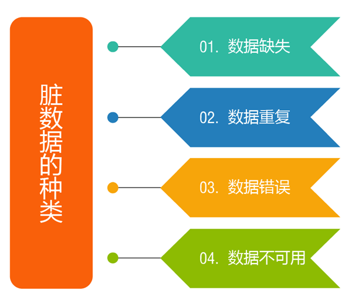
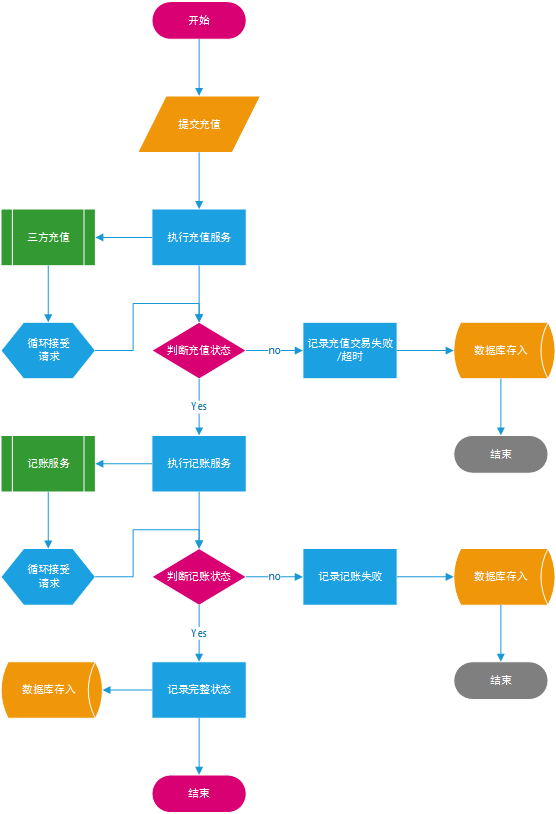
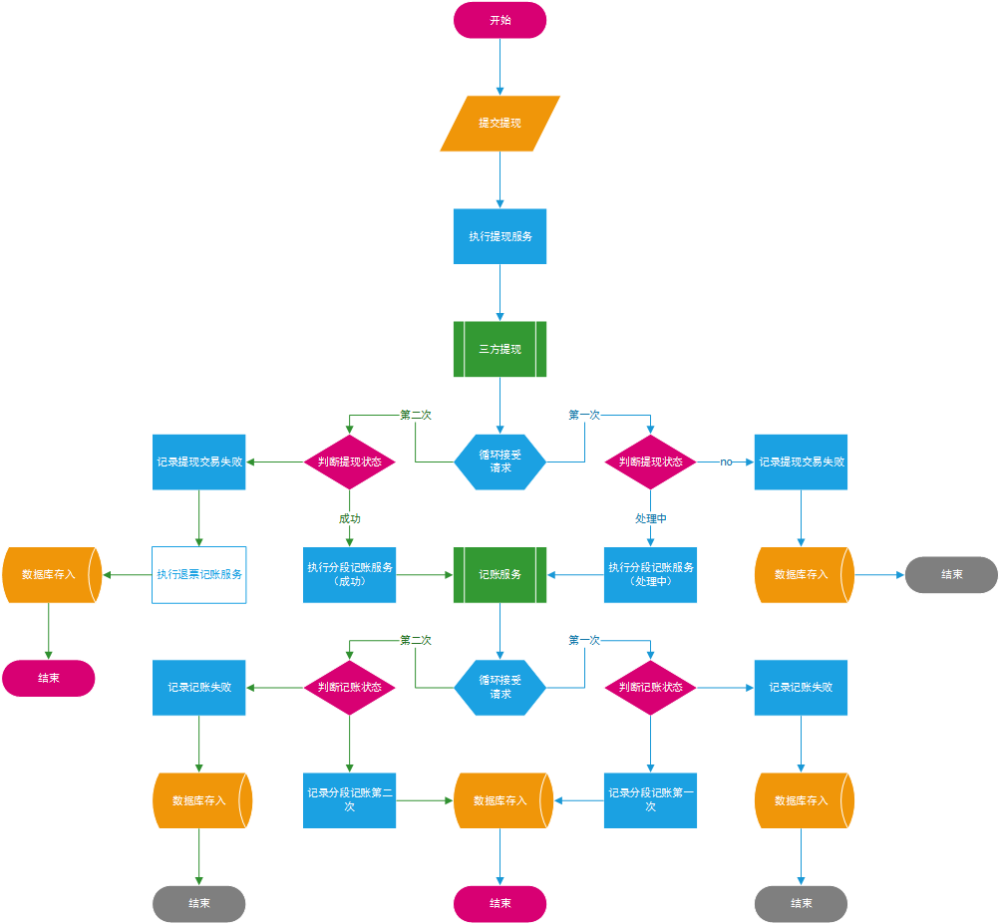

# 问题数据收集与修复

## 目录
[TOC]

## 问题描述(收集需求)
在公司生产系统运行过程中，系统中产生的数据不在给定的范围内或对于实际业务毫无意义的数据，或是数据格式非法，以及在源系统中存在中断的业务逻辑。这些脏数据就是本次需要解决的问题。首先，我们来了解一下脏数据的种类，明白我们会面对哪些问题。

**数据缺失:**
缺一些记录，或者一条记录里缺一些值（空值），或者两者都缺。原因可能有很多种，系统导致的或人为导致的可能性都存在。如果有空值，为了不影响分析的准确性，要么不将空值纳入分析范围，要么进行补值。前者会减少分析的样本量，后者需要根据分析的计算逻辑，选择用平均数、零、或者等比例随机数等来填补。如果是缺一些记录，若业务系统中还有这些记录，则通过系统再次导入，若业务系统也没有这些记录了，只能手工补录或者放弃。这影响到系统稳定性，增加人工成本，增加人为出错几率。

### 业务问题数据
现在在生产系统中出现的问题大部分都是数据缺失。我们根据**生产业务**以及**数据结构**总结为以下问题：
1. 在充值过程中，数据状态显示充值**成功**，但是生产系统账户**金额并没有增加**
2. 在提现过程中，数据状态显示提现**成功**，但是生产系统账户**未扣除提现金额**，银行账户并**没有收到到帐通知**
3. 在提现过程中，数据状态显示提现**成功**，但是生产系统账户**已扣除提现金额**，银行账户并**没有收到到帐通知**
4. 在充值过程中，数据状态显示充值**失败**，但是银行账户**已扣除充值金额**，生产系统账户**金额并没有增加**
5. 在充值过程中，数据状态长时间显示充值**处理中**，但是银行账户**已扣除充值金额**，生产系统数据状态**没有显示成功**，生产系统账户**金额并没有增加**
6. 在充值过程中，数据状态长时间显示充值**处理中**，但是银行账户**未扣除充值金额**，生产系统数据状态**没有显示失败**
7. 在提现过程中，数据状态显示提现**失败**，但是生产系统账户**已扣除提现金额**，但是银行账户并**没有收到到帐通知**
8. 在提现过程中，数据状态长时间显示提现**处理中**，但是银行账户**已经收到到帐通知**，生产系统账户金额并没有增加
9. 在提现过程中，数据状态长时间显示提现**处理中**，但是银行账户**没有收到到帐通知**，生产系统数据状态没有显示失败

## 问题分析(解释需求)
在举出刚才的问题后，现在来分析生产系统中的业务流程。
> 灰色形状代表**问题数据产生流程**

`充值流程`问题现象：
> 充值成功，记录未记账（实际成功）
> 充值超时，记录未记账（实际成功）
> 充值失败，记录未记账（实际成功）

_ _ _

`充值流程`问题现象：
> 提现成功，记录未记账（实际成功）
> 提现超时，记录未记账（实际成功）
> 提现失败，记录未记账（实际成功）

`一次性提现流程`：

_ _ _

`充值流程`问题现象：
> 提现成功，记录一次记账（实际成功）
> 提现超时，记录一次记账（实际成功）
> 提现失败，记录一次记账（实际成功）

`分段式提现流程`：

_ _ _
## 解决方案(制定解决问题方案)
根据以上生产系统产生的问题数据做以下修复方案：
1. 收集问题数据
2. 根据规则修复
3. 修复问题数据

### 收集问题数据
如何收集数据呢？我们通过**`piculus系统`**发送收集问题数据的指令，各个生产系统接受指令来完成收集。**`piculus系统`**会通过在指令中发送收集问题数据的时间跨度（开始时间和结束时间）来指导各个生产系统完成收集。因为生产系统在运行各个服务的时候，并不能马上完成数据的写入。也就是在当前时间往**前推5分钟**,这个时间段的数据我们默认是正常的。指令指定结束时间生产系统**会减去5分钟执行收集**。

### 根据规则修复
在收集数据完成后，每一个收集数据服务相应的会有个默认修复服务。这个服务我们需要到piculus系统中去注册该修复服务的合法性。相应的还需要配置一些参数，一会我们会讲到该参数有什么用。
URL地址：http://${piculus}/piculus-service/views/addSolution.html

| 参数名称 | 默认值 | 值列表 | 解释 |
|--------|--------|--------|--------|
|系统组别|  |PBAP、PBMS... | 生产系统sysCode |
|修复代号|  | interRechargeFixServiceImpl.. | 修复服务实例名，首字符小写 |
|最大重试次数| 0 | 0～99 |        |
|重试间隔| 0 0/2 * * * ? | `* * * * * *` | cron表达式 |
|执行方式| 自动 | 自动/手动 | 选择手动需要在piculus中点击执行，自动使用cron表达式执行 |
|方案状态| 正常 | 正常/失效 | 正常代表该修复代号可以使用，失效就不能使用 |
|方案等级| 非常重要  | 不重要/一般/重要/非常重要 | 标记数据重要程度 |
|描述|  |        | 描述修复代号作用方便查看 |

### 修复问题数据
根据业务问题现在依次根据问题创建修复服务

查询SQL：
SELECT TRD_ID,TRD_NUM,TRD_STATUS,ACC_TRD_NUM,ACC_TRD_STATUS,E_ACC_TRD_NUM,E_ACC_TRD_STATUS,FAILED_MSG FROM TPBAP_TRD_ACC_TRADE WHERE TRD_CODE='CO' AND TRD_STATUS=8 AND TRD_NUM=‘？’;

#### 充值成功未记账

修复前：

|TRD_ID |TRD_NUM              |TRD_STATUS |ACC_TRD_NUM          |ACC_TRD_STATUS |E_ACC_TRD_NUM |E_ACC_TRD_STATUS |FAILED_MSG |
|-------|---------------------|-----------|---------------------|---------------|--------------|-----------------|-----------|
|75     |CO160724154936100036 |8          | |0| |                 |充值成功修复

修复成功后：

|TRD_ID |TRD_NUM              |TRD_STATUS |ACC_TRD_NUM          |ACC_TRD_STATUS |E_ACC_TRD_NUM |E_ACC_TRD_STATUS |FAILED_MSG |
|-------|---------------------|-----------|---------------------|---------------|--------------|-----------------|-----------|
|75     |CO160724154936100036 |8          |GA160724154946100112 |1              |              |                 |充值成功修复

#### 提现成功一次记账

查询SQL：
SELECT TRD_ID,TRD_NUM,TRD_STATUS,ACC_TRD_NUM,ACC_TRD_STATUS,E_ACC_TRD_NUM,E_ACC_TRD_STATUS,FAILED_MSG FROM TPBAP_TRD_ACC_TRADE WHERE TRD_CODE='CO' AND TRD_STATUS=8 AND TRD_NUM=‘？’;

修复前：

|TRD_ID |TRD_NUM              |TRD_STATUS |ACC_TRD_NUM |ACC_TRD_STATUS |E_ACC_TRD_NUM |E_ACC_TRD_STATUS |FAILED_MSG |
|-------|---------------------|-----------|------------|---------------|--------------|-----------------|-----------|
|679    |WD160731140732100269 |8          |            |0              |              |0                |

修复成功后：

|TRD_ID |TRD_NUM              |TRD_STATUS |ACC_TRD_NUM |ACC_TRD_STATUS |E_ACC_TRD_NUM |E_ACC_TRD_STATUS |FAILED_MSG |
|-------|---------------------|-----------|------------|---------------|--------------|-----------------|-----------|
|679    |WD160731140732100269 |8          |GA160724154946100113 |1              |GA160724154946100113 |1                | 提现成功修复

#### 提现成功分段修复成功后：修复成功后：修复成功后：记账

修复前：

|TRD_ID |TRD_NUM              |TRD_STATUS |ACC_TRD_NUM |ACC_TRD_STATUS |E_ACC_TRD_NUM |E_ACC_TRD_STATUS |FAILED_MSG |
|-------|---------------------|-----------|------------|---------------|--------------|-----------------|-----------|
|679    |WD160731140732100269 |8          | GA160724154946100113|1              |              |0                |

修复成功后：

|TRD_ID |TRD_NUM              |TRD_STATUS |ACC_TRD_NUM |ACC_TRD_STATUS |E_ACC_TRD_NUM |E_ACC_TRD_STATUS |FAILED_MSG |
|-------|---------------------|-----------|------------|---------------|--------------|-----------------|-----------|
|679    |WD160731140732100269 |8          |GA160724154946100113 |1              |GA160724154946100114 |1                | 提现成功修复

#### 充值失败未记账

修复前：

|TRD_ID |TRD_NUM              |TRD_STATUS |ACC_TRD_NUM          |ACC_TRD_STATUS |E_ACC_TRD_NUM |E_ACC_TRD_STATUS |FAILED_MSG |
|-------|---------------------|-----------|---------------------|---------------|--------------|-----------------|-----------|
|75     |CO160724154936100036 |9          | |0| | |...

修复成功后：

TRD_ID |TRD_NUM              |TRD_STATUS |ACC_TRD_NUM          |ACC_TRD_STATUS |E_ACC_TRD_NUM |E_ACC_TRD_STATUS |FAILED_MSG |
-------|---------------------|-----------|---------------------|---------------|--------------|-----------------|-----------|
75     |CO160724154936100036 |8          |GA160724154946100112 |1              |              |                 |充值成功修复|

#### 充值超时未记账

修复前：

|TRD_ID |TRD_NUM              |TRD_STATUS |ACC_TRD_NUM          |ACC_TRD_STATUS |E_ACC_TRD_NUM |E_ACC_TRD_STATUS |FAILED_MSG |
|-------|---------------------|-----------|---------------------|---------------|--------------|-----------------|-----------|
|75     |CO160724154936100036 |0          | |0| | |

修复成功后：

|TRD_ID |TRD_NUM              |TRD_STATUS |ACC_TRD_NUM          |ACC_TRD_STATUS |E_ACC_TRD_NUM |E_ACC_TRD_STATUS |FAILED_MSG |
|-------|---------------------|-----------|---------------------|---------------|--------------|-----------------|-----------|
|75     |CO160724154936100036 |8          |GA160724154946100112 |1              |              |                 |充值成功修复
或

|TRD_ID |TRD_NUM              |TRD_STATUS |ACC_TRD_NUM          |ACC_TRD_STATUS |E_ACC_TRD_NUM |E_ACC_TRD_STATUS |FAILED_MSG |
|-------|---------------------|-----------|---------------------|---------------|--------------|-----------------|-----------|
|75     |CO160724154936100036 |9          | |0              |              |                 |充值成功修复

#### 提现失败一次记账

修复前：

|TRD_ID |TRD_NUM              |TRD_STATUS |ACC_TRD_NUM          |ACC_TRD_STATUS |E_ACC_TRD_NUM        |E_ACC_TRD_STATUS |FAILED_MSG |
|-------|---------------------|-----------|---------------------|---------------|---------------------|-----------------|-----------|
|719    |WD160731221523100283 |9          | |0              |                     |0                |...

修复成功后：

|TRD_ID |TRD_NUM              |TRD_STATUS |ACC_TRD_NUM          |ACC_TRD_STATUS |E_ACC_TRD_NUM        |E_ACC_TRD_STATUS |FAILED_MSG |
|-------|---------------------|-----------|---------------------|---------------|---------------------|-----------------|-----------|
|719    |WD160731221523100281 |8          |GA160731221523100867 |1              |GA160731221523100867 |1                |充值成功修复

#### 提现失败分段记账

修复前：

|TRD_ID |TRD_NUM              |TRD_STATUS |ACC_TRD_NUM          |ACC_TRD_STATUS |E_ACC_TRD_NUM        |E_ACC_TRD_STATUS |FAILED_MSG |
|-------|---------------------|-----------|---------------------|---------------|---------------------|-----------------|-----------|
|719    |WD160731221523100281 |9          |GA160731221523100867 |1              |                     |0                |...

修复成功后：

|TRD_ID |TRD_NUM              |TRD_STATUS |ACC_TRD_NUM          |ACC_TRD_STATUS |E_ACC_TRD_NUM        |E_ACC_TRD_STATUS |FAILED_MSG |
|-------|---------------------|-----------|---------------------|---------------|---------------------|-----------------|-----------|
|719    |WD160731221523100281 |8          |GA160731221523100867 |1              |GA160731221523100868 |1                |充值成功修复

#### 提现超时未记账

修复前：

|TRD_ID |TRD_NUM              |TRD_STATUS |ACC_TRD_NUM          |ACC_TRD_STATUS |E_ACC_TRD_NUM        |E_ACC_TRD_STATUS |FAILED_MSG                                                                        |
|-------|---------------------|-----------|---------------------|---------------|---------------------|-----------------|----------------------------------------------------------------------------------|
|94     |WD160725131938100013 |0          |                     |0              |                     | 0 |

修复成功后：

|TRD_ID |TRD_NUM              |TRD_STATUS |ACC_TRD_NUM          |ACC_TRD_STATUS |E_ACC_TRD_NUM        |E_ACC_TRD_STATUS |FAILED_MSG                                                                        |
|-------|---------------------|-----------|---------------------|---------------|---------------------|-----------------|----------------------------------------------------------------------------------|
|94     |WD160725131938100013 |8          | GA160725222426100380 |1              | GA160725222426100380   |1                | 充值成功修复
或

|TRD_ID |TRD_NUM              |TRD_STATUS |ACC_TRD_NUM          |ACC_TRD_STATUS |E_ACC_TRD_NUM        |E_ACC_TRD_STATUS |FAILED_MSG                                                                        |
|-------|---------------------|-----------|---------------------|---------------|---------------------|-----------------|----------------------------------------------------------------------------------|
|94     |WD160725131938100013 |9          |  |0              |    |0                | 充值成功修复

